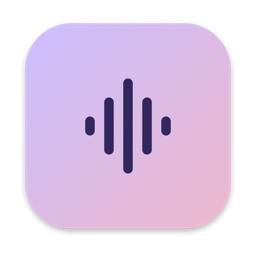
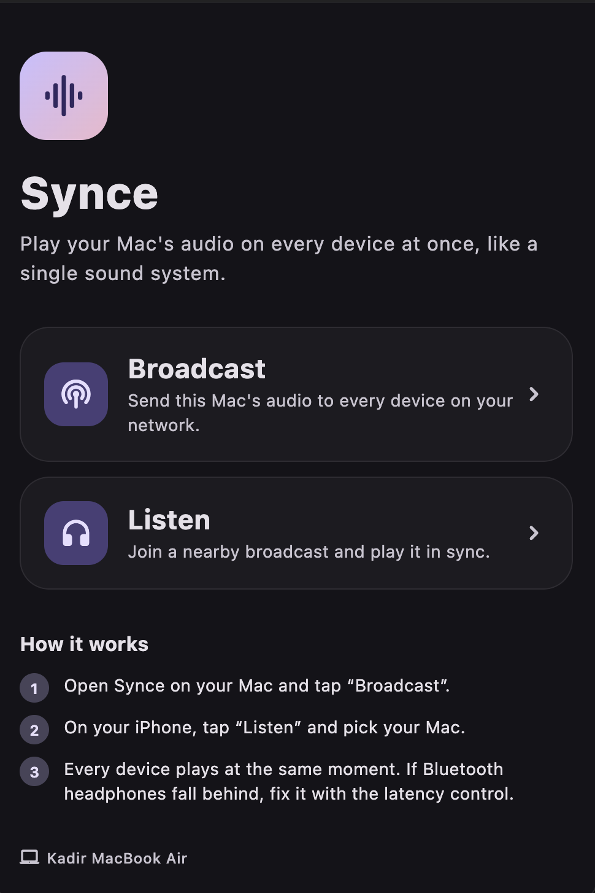
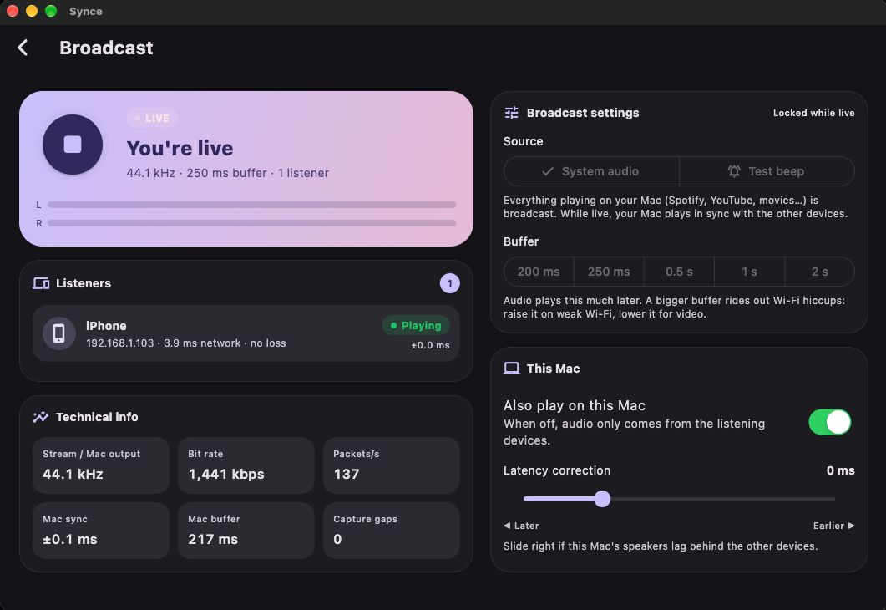
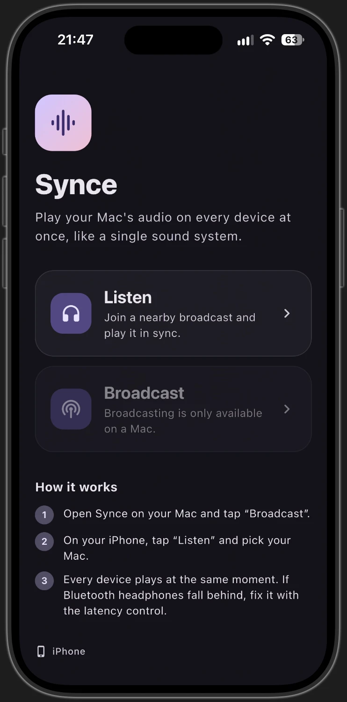
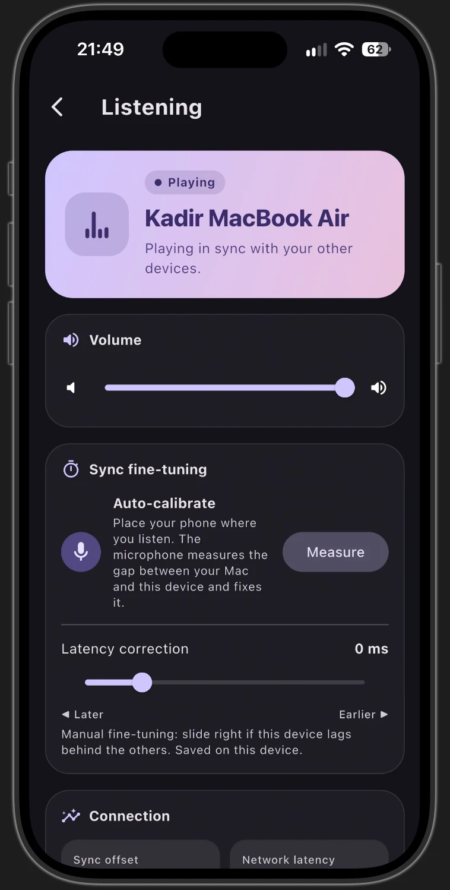
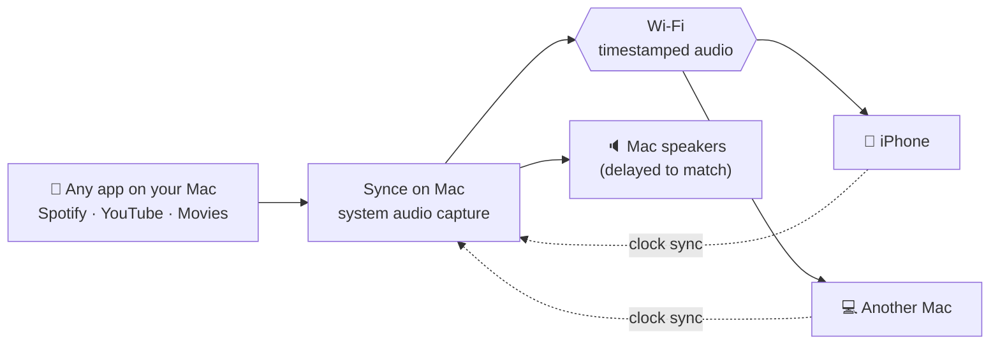

# Synce

**Play your Mac's audio on every device at once — like a single sound system.**

Stream everything your Mac plays (Spotify, YouTube, movies, games…) to iPhones and other Macs on your Wi‑Fi, perfectly in sync and in full quality.

---

## 📸 Screenshots

<table>
  <tr>
    <th>Mac · Home</th>
    <th>Mac · Live broadcast</th>
  </tr>
  <tr>
    <td></td>
    <td></td>
  </tr>
</table>

<table>
  <tr>
    <th>iPhone · Home</th>
    <th>iPhone · Listening</th>
  </tr>
  <tr>
    <td></td>
    <td></td>
  </tr>
</table>

---

## ✨ Why Synce

| | |
|---|---|
| 🎧 **Full quality** | Uncompressed 16‑bit PCM at your Mac's native rate (44.1 / 48 kHz). Listeners hear exactly what the Mac plays — no crackles, no pitch drift. |
| ⏱️ **Tiny delay** | 250 ms default buffer (adjustable up to 2 s). Good for music *and* video. |
| 🎯 **Tight sync** | Devices stay within ~0.2 ms of each other on a normal home Wi‑Fi. |
| 🔊 **Any app, zero setup** | Captures the whole system output. No drivers, no plugins, no extra software. |
| 🎙️ **Auto-calibrate** | One tap: the phone's microphone measures the gap between the Mac and itself and fixes it — even for Bluetooth speakers. |
| 📡 **Finds devices by itself** | Tap *Listen* and pick your Mac from the list. |
| 🛡️ **Loopback protection** | Automatically ignores audio that would echo back into the stream (e.g. iPhone Mirroring). |
| 🔒 **Local only** | Audio never leaves your network. No accounts, no cloud. |

---

## 🛠️ How it works

1. **Capture** – Synce taps the Mac's system output and reads it at its true sample rate.
2. **Timestamp** – Every audio packet carries the exact moment it should be heard.
3. **Clock sync** – Each listener continuously tracks the Mac's clock (offset and drift), so all devices share one timeline.
4. **Precise playback** – Listeners resample with a high-quality filter and make inaudible micro speed adjustments to stay locked — no skipped or repeated samples.
5. **Everyone plays together** – The Mac plays the same audio with the same delay, so the whole room sounds like one system.

Lost packets are re-requested automatically, and playback accounts for each device's real output latency (speakers, AirPods, external DACs).

---

## 🆚 Compared to typical streaming

| | **Synce** | Typical AirPlay‑style streaming |
|---|:---:|:---:|
| Default delay | **250 ms** | ~2 s |
| Device‑to‑device sync | **~0.2 ms** | varies |
| Audio format | **Uncompressed PCM** | often compressed |
| Mic auto‑calibration | **✅** | ❌ |
| Listener app | **Free** | varies |

---

## 🚀 Getting started

1. Open Synce on your Mac, tap **Broadcast** and start.
2. On your iPhone, open Synce, tap **Listen** and choose your Mac.
3. Enjoy. If a Bluetooth speaker lags, tap **Measure** or nudge the latency slider.

> On the first broadcast, macOS asks for **System Audio Recording** permission
> (System Settings › Privacy & Security › Screen & System Audio Recording).

---

## 🗺️ Roadmap

- [x] macOS broadcaster, iOS & macOS listeners
- [x] Microphone auto-calibration
- [x] English & Turkish
- [ ] App Store release (free listening, one-time **Pro** unlock for broadcasting)
- [ ] Per-app capture, multiple rooms
- [ ] Android & Windows

---

Made with ♥ by **Kadir Köroğlu** · Source code is private.

